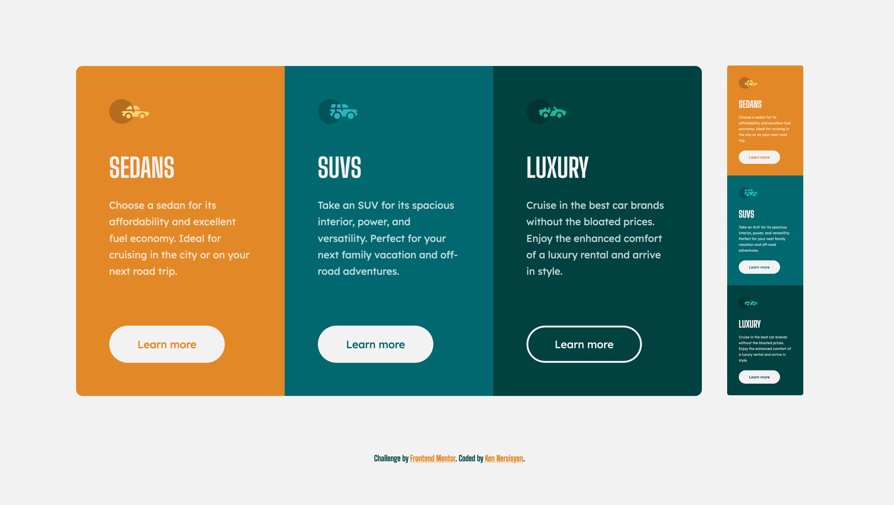

# Frontend Mentor - 3-Column Preview Card Component Solution

This is a solution to the [3-column preview card component challenge on Frontend Mentor](https://www.frontendmentor.io/challenges/3column-preview-card-component-pH92eAR2-).

## Table of contents

- [Overview](#overview)
  - [The challenge](#the-challenge)
  - [Screenshot](#screenshot)
  - [Links](#links)
- [My process](#my-process)
  - [Built with](#built-with)
  - [What I learned](#what-i-learned)
  - [Continued development](#continued-development)
  - [Useful resources](#useful-resources)
- [Author](#author)

## Overview

### The challenge

Users should be able to:

- View the optimal layout depending on their device's screen size
- See hover states for interactive elements

### Screenshot



### Links

- Solution URL: [https://www.frontendmentor.io/solutions/css-custom-properties-css-flexbox-css-grid-xOljzZQUJ](https://www.frontendmentor.io/solutions/css-custom-properties-css-flexbox-css-grid-xOljzZQUJ)
- Live Site URL: [https://kens-visuals.github.io/3-column/](https://kens-visuals.github.io/3-column/)

## My process

### Built with

- Semantic HTML5 markup
- SCSS variables
- CSS Flexbox
- CSS Grid
- Mobile-first workflow

### What I learned

I experimented with CSS Grid where my goal was to make the project fully responsive using media queries as little as possible

To see how you can add code snippets, see below:

```html
<div class="col">
  <div class="col--1">
    <h1 class="col__heading">Sedans</h1>
    <p class="col__text">Choose a sedan for its affordability...</p>
    <a class="btn orange">Learn more</a>
  </div>
</div>
```

```css
.col {
  /* ... */
  display: grid;
  grid-template-columns: repeat(auto-fit, minmax(20rem, 1fr));
  /* ... */
}
```

### Continued development

Planning on using more CSS Grid and Flexbox, to improve the overall workflow and maintainability of the code. Also considering on researching about media queries and responsive web development

### Useful resources

- [stackedit.io](https://stackedit.io/) - This website helped me to write my markdown files faster and easier, highly recommended.

- [Flexbox Cheat Sheet](https://yoksel.github.io/flex-cheatsheet/) and [Grid Cheat Sheet](https://yoksel.github.io/grid-cheatsheet/) - These two amazing websites can be very useful for beginners to improve their skills in CSS flexbox and grid.

## Author

- Frontend Mentor - [@kens-visuals](https://www.frontendmentor.io/profile/kens-visuals)
- Codewars - [@kens_visuals](https://www.codewars.com/users/kens_visuals)
- CodePen - [@kens-visuals](https://codepen.io/kens-visuals)
